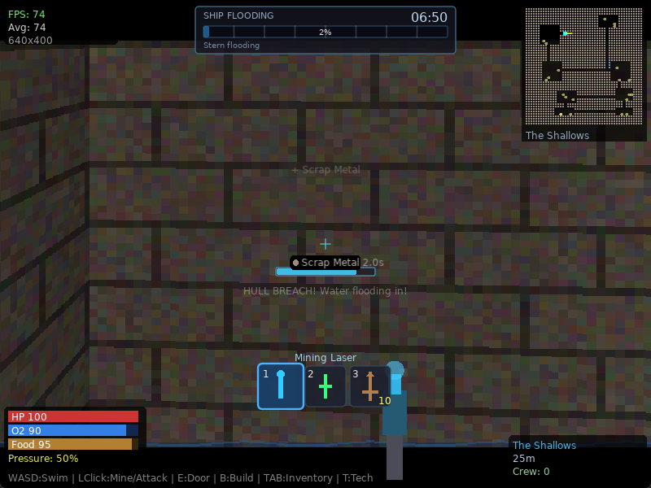

# Thresher's Hope

**A Love2D raycaster survival game set aboard a sinking ship: escape the flood, then survive the deep — rendered with a from-scratch DDA raycaster over procedurally generated levels.**



## What it does

Thresher's Hope is a first-person survival game built on a hand-written raycasting renderer (the classic Wolfenstein-style DDA algorithm, no 3D engine). It runs in two phases:

- **Sinking phase** — your ship is flooding. Mine through walls (which creates hull breaches and lets water in), grab resources, and find a way out against a timer.
- **Survival phase** — an underwater colony loop with mining, building, crafting, power management, a tech tree, crew, and enemies.

Under the renderer sits a full simulation stack: procedural BSP world generation with 9 biomes, dynamic flooding/water simulation, atmosphere (fog, vignette, disturbance, color grading), doors, corruption, depth/pressure, and a narrative/lore layer.

## Status

**Working prototype — the core is solid and now renders correctly.** All 25 Lua modules are syntax-clean and the game boots and plays. This repo's first commit fixes the bug that had shelved the project: the 3D environment rendered pure black (only the HUD showed) because the atmosphere vignette was composited in `multiply` blend mode over a black-alpha canvas, multiplying the whole view to black. It's fixed — the world is fully visible (see screenshot).

Rough edges: no sound at all, no save/load, balance is untuned, and the two phases aren't fully connected into one arc.

## How to run

Requires [LÖVE 11.4](https://love2d.org/).

```
love .          # from this directory
lovec .         # console build, prints boot log
```

Controls: `WASD` swim · mouse look · `LClick` mine/build/attack · `E` door · `B` build · `TAB` inventory · `Q/R` cycle · `T` tech · `M` minimap · `F` FPS.

## Known issues / roadmap

See [`docs/GAP_ANALYSIS.md`](docs/GAP_ANALYSIS.md). Short version: add audio (zero sound calls today), save/load, connect the sinking→survival arc, and untangle balance. The renderer, worldgen, and simulation systems are the strong foundation to build on.

## AI development note

Developed and debugged with AI assistance — **Anthropic Claude** (Claude Code) for implementation and **OpenAI Codex** for review. Human direction owned the design and priorities. The 2026-07-02 pass set up this repository and fixed the vignette blend-mode bug that was blacking out the 3D view.

## Use

This project is **free to use, fork, and build upon** — for your own games,
learning, or anything else. No credit or attribution needed.

## License & attribution

Proprietary — see [LICENSE](LICENSE). Licensed under the **Ephemeral / Proprietary License** (All Rights Reserved with a Sharing Exception).

The raycasting renderer is based on the classic **DDA raycasting algorithm** and
was built with reference to existing open-source Love2D/Lua raycaster
implementations and tutorials (found and adapted with AI assistance during
development). It is not a wholly original renderer. If you plan to redistribute
this code, note that portions may derive from third-party sources that carry
their own licenses — verify and preserve those before publishing.
